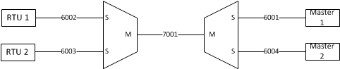
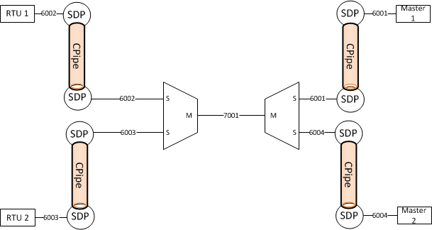

Intro
-----

When the company I work for upgraded their WAN infrastructure, one of the selling points of going to [Alcatel-Lucent](http://alcatel-lucent.com) was that they had better support for TDM and legacy equipment. It would have the ability to slowly (but eventually) allow us to migrate away from Digital Cross Connects (DCS) and channel banks while still providing those legacy circuits.

Well, I recently got a new toy at work: an Alcatel-Lucent ISC (Integrated Services Card). This allows us to do RS232 bridging. Now, I don't know how all company's do SCADA bridging, but we prefer to have active/active masters. This isn't a feature that Alcatel-Lucent has in the ISC by default, but we can work around it. Here's what our final end state should look like:

The Old Way (TDM)
-----------------

The old way involved a lot of predefined TDM links. All of the routes are predetermined by an engineer and if one of the links has a failure, that circuit is down.

The above drawing is simplified as it shows only one Master and one Remote. Typically, you'll have two masters that connect to any number of remotes.

The New Way (MPLS)
------------------

So now that we've seen how things were done with TDM, why would we want to use MPLS? One of the benefits of MPLS over TDM is that MPLS can route around failures. So if your sites are connected via multiple links, the odds of failure goes down and also means that instead of needing to call out a tech at 0200 on a Sunday morning, the RTU will stay up and the tech can start troubleshooting on Monday. MPLS allows us to remove another point of failure and route around it. Yes, equipment failure can still happen, but if the failure is not on the terminal equipment, clients will be less likely to notice.

Circuit Building
----------------

Before we can get to the end state, we need to start from the basics. Here are the circuits we are going to build:
1. 1 Master, 2 Remotes on a single Alcatel-Lucent 7705 SAR
2. 2 Masters (active/standby), 2 Remotes on a single Alcatel-Lucent 7705 SAR
3. 2 Masters (active/active), 2 Remotes on a single Alcatel-Lucent 7705 SAR
4. 2 Masters (active/active), 2 Remotes on multiple Alcatel-Lucent 7705 SARs

Before we get to the actual config, here is some conventions:
- SCADA Bridges are on 1/2/1 through 1/2/16
- RS232 ports are on 1/6/1 through 1/6/12
- RS232 to SCADA C-Pipe id's start with 6xxx
- SCADA Bridge to SCADA Bridge C-Pipe id's start with 7xxx
- B1 is the Alcatel-Lucent 7705 SAR with the ISC Card
- M1 and M2 are the Alcatel-Lucent 7705 SARs with the Masters attached (only for bridge configuration 4)
- R1, R2, and R2 are the Alcatel-Lucent 7705 SARs with the Remotes attached (only for bridge configuration 4)

### Port configuration ###

In order to build bridges, we need RS232 ports configured properly.

    A:B1# /configure port 1/6/1
    A:B1>config>port# info
    ----------------------------------------------
        description "to Master 1"
        serial
            rs232
                device-mode asynchronous
                channel-group 1
                    encap-type cem
                    no shutdown
                exit
                no shutdown
            exit
        exit
        no shutdown
    ----------------------------------------------

You will need to do this for each RS232 port you use. And obviously you will need to update the description.

I will be using 1/6/1 for Master 1, 1/6/2 for Master 2, 1/6/3 for RTU A, and 1/6/4 for RTU B.

### Circuit 1: 1 Master, 2 Remotes ###

Let's start with something simple. 1 Master and two remotes.

    A:B1>config>port# /configure scada 1/2/1
    A:B1>config>scada# info
    ----------------------------------------------
        description "Master Bridge 1"
        branch 1
            description "to Master 1"
            no shutdown
        exit
        branch 3
            description "to RTU 1"
            no shutdown
        exit
        branch 4
            description "to RTU 2"
            no shutdown
        exit
        no shutdown
    ----------------------------------------------
    A:B1>config>scada# /configure service cpipe 6001
    A:B1>config>service>cpipe# info
    ----------------------------------------------
                description "Master 1 to Bridge 1"
                sap 1/2/1.1 create
                    description "to Bridge 1"
                    ingress
                        qos 64
                    exit
                    egress
                        qos 64
                    exit
                exit
                sap 1/6/1.1 create
                    description "to Master 1"
                    ingress
                        qos 64
                    exit
                    egress
                        qos 64
                    exit
                exit
                no shutdown
    ----------------------------------------------
    A:B1>config>service>cpipe# /configure service cpipe 6002
    A:B1>config>service>cpipe# info
    ----------------------------------------------
                description "RTU 1 to Bridge 1"
                sap 1/2/1.3 create
                    description "to Bridge 1"
                    ingress
                        qos 64
                    exit
                    egress
                        qos 64
                    exit
                exit
                sap 1/6/3.1 create
                    description "to RTU 1"
                    ingress
                        qos 64
                    exit
                    egress
                        qos 64
                    exit
                exit
                no shutdown
    ----------------------------------------------
    A:B1>config>service>cpipe# /configure service cpipe 6003
    A:B1>config>service>cpipe# info
    ----------------------------------------------
                description "RTU 2 to Bridge 1"
                sap 1/2/1.4 create
                    description "to Bridge 1"
                    ingress
                        qos 64
                    exit
                    egress
                        qos 64
                    exit
                exit
                sap 1/6/4.1 create
                    description "to RTU 2"
                    ingress
                        qos 64
                    exit
                    egress
                        qos 64
                    exit
                exit
                no shutdown
    ----------------------------------------------

### Circuit 2: 2 Masters (active/standby), 2 Remotes ###

And now we'll add a second master. The way the masters work is that one is active and one is passive. There is no automatic failover by default (hopefully Alcatel-Lucent adds that to a future release). You can manually fail between the two. The example shows that the second master is primary.

    config here

### Circuit 3: 2 Masters (active/active), 2 Remotes ###

And now for the

### Circuit 4; 2 Masters (active/active), 2 Remotes on multiple SARs ###

